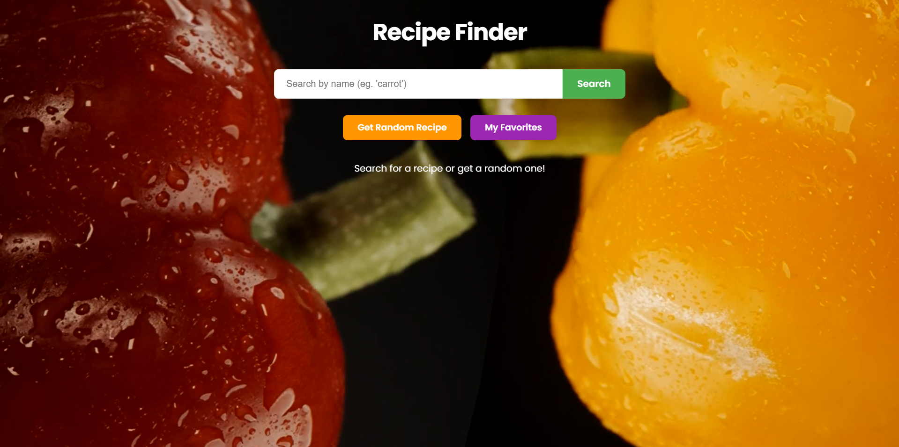

# 🍽️ Recipe Finder

A sleek and responsive web application that lets you **search for recipes** by name or get **random meal ideas** — powered by the awesome [TheMealDB API](https://www.themealdb.com/api.php) 🍲✨

---



---

## ✨ Features 

🔍 **Search** for recipes by name  
🎲 Get a **random recipe** suggestion  
📋 View full recipe details, including:  
  - 🧂 Ingredients & Measurements  
  - 🔪 Cooking Instructions  
  - 🗂️ Category & Origin  
  - ▶️ YouTube Video (if available)  
  - 🌐 Original Source Link  

💻 **Responsive Design** – works great on all screen sizes  
🎞️ **Video Background** – adds a modern and dynamic feel  
🎨 **Smooth UI/UX** – clean interface with soft animations  

---

## 🛠️ Technologies Used

- 🧱 **HTML5**  
- 🎨 **CSS3**  
- 💡 **JavaScript (ES6)**  
- 🍜 [TheMealDB API](https://www.themealdb.com/api.php)  

---
## 🚀 Installation

🖥️ **No installation needed!**  
Just open the `index.html` file directly in your browser.

Or host it online:

📦 Clone this repository:
```bash
   git clone https://github.com/your-username/recipe-finder.git
```
☁️ **Upload all files** to any web server

🌐 **Open your browser** and access via your domain


---

## 🧑‍🍳 Usage

🔍 Enter a food name in the search box (e.g., `"pasta"`)  
💥 Click on **Search** or press **Enter**  
📃 Browse the results  
👆 Click on a recipe to **view full details**  
🎲 Click on **"Get Random Recipe"** for a surprise dish!

---


## 🙌 Credits

- 🍛 **API**: [TheMealDB](https://www.themealdb.com)  
- 💡 **Icons**: Emojis and open web resources  
- ❤️ Designed with love and a little hunger 😋

---

## 🪪 License

📄 This is an open-source project — feel free to use, share, remix, and improve it!


