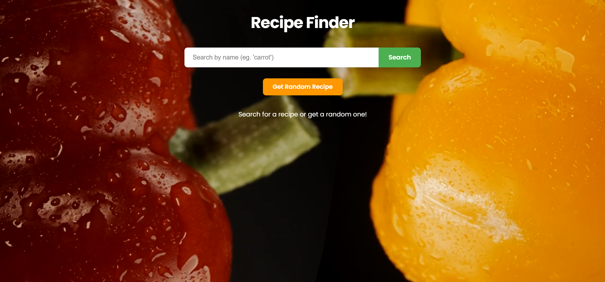

# Recipe Finder 🍳

A modern, responsive web application that allows users to search for recipes by name or get random recipe suggestions from TheMealDB API. Discover culinary delights with an intuitive interface and beautiful design.



## Contributors

- [khemraj-giri](https://github.com/khemraj-git)

## Features

- 🔍 **Search Recipes**: Search for recipes by name with instant results
- 🎲 **Random Recipes**: Get inspired with random recipe suggestions
- ⭐ **Favorites System**: Save your favorite recipes locally for quick access
- 📱 **Responsive Design**: Works seamlessly on desktop, tablet, and mobile devices
- 🎨 **Modern UI**: Clean, modern interface with smooth animations and glassmorphism effects
- 🎥 **Video Background**: Attractive video background for an immersive experience
- 📋 **Detailed Information**: View comprehensive recipe details including:
  - Ingredients and measurements
  - Step-by-step cooking instructions
  - Category and cuisine origin
  - YouTube video links (when available)
  - Original source links
- 💾 **Local Storage**: Your favorites are saved locally in your browser

## Technologies Used

- **HTML5**: Semantic markup and structure
- **CSS3**: Modern styling with CSS Grid, Flexbox, and animations
- **JavaScript (ES6+)**: Vanilla JavaScript for functionality
- **TheMealDB API**: Free recipe database API (https://www.themealdb.com/api.php)

## Installation

No installation or build process required! Simply follow these steps:

### Option 1: Direct Browser Access

1. Clone or download this repository
2. Open the `index.html` file in your web browser
3. Start searching for recipes!

### Option 2: Local Web Server

1. Clone this repository:
   ```bash
   git clone https://github.com/your-username/Find-Recipe.git
   cd Find-Recipe
   ```

2. Use a local web server (recommended):
   ```bash
   # Using Python 3
   python -m http.server 8000
   
   # Using Node.js (http-server)
   npx http-server
   
   # Using PHP
   php -S localhost:8000
   ```

3. Open your browser and navigate to `http://localhost:8000`

### Option 3: Deploy to Web Hosting

1. Clone this repository
2. Upload all files to your web server
3. Access via your domain

## Usage

1. **Search for Recipes**:
   - Enter a search term in the input field (e.g., "pasta", "chicken", "dessert")
   - Click "Search" or press Enter
   - Browse through the recipe results

2. **Get Random Recipe**:
   - Click the "Random Recipe" button
   - Discover new recipes you might not have tried

3. **View Recipe Details**:
   - Click on any recipe card to view detailed information
   - See ingredients, instructions, and additional resources

4. **Save Favorites**:
   - Click the star icon (★) on any recipe to add it to favorites
   - Access your saved recipes by clicking "My Favorites"
   - Remove favorites by clicking the star again

5. **Navigate**:
   - Use "Back to Results" to return to your search results
   - Close the recipe modal by clicking the X button or pressing Escape

## File Structure

```
Find-Recipe/
│
├── index.html          # Main HTML file
├── style.css           # Stylesheet with modern design
├── main.js             # JavaScript functionality
├── README.md           # Project documentation
│
└── assects/            # Assets directory
    ├── bg.mp4          # Background video
    └── webpage.png     # Screenshot image
```

## API Information

This project uses [TheMealDB API](https://www.themealdb.com/api.php), a free, open recipe database.

### API Endpoints Used:

- **Search by Name**: `https://www.themealdb.com/api/json/v1/1/search.php?s={name}`
- **Random Recipe**: `https://www.themealdb.com/api/json/v1/1/random.php`
- **Lookup by ID**: `https://www.themealdb.com/api/json/v1/1/lookup.php?i={id}`

## Browser Support

- ✅ Chrome (latest)
- ✅ Firefox (latest)
- ✅ Safari (latest)
- ✅ Edge (latest)
- ✅ Opera (latest)

## Features in Detail

### Search Functionality
- Real-time recipe search
- Case-insensitive search
- Displays multiple results in a grid layout
- Handles empty results gracefully

### Favorites System
- Local storage-based favorites
- Persistent across browser sessions
- Easy add/remove functionality
- Visual feedback with star animations

### Responsive Design
- Mobile-first approach
- Adaptive grid layout
- Touch-friendly interface
- Optimized for all screen sizes

## Contributing

Contributions are welcome! If you'd like to contribute:

1. Fork the repository
2. Create a feature branch (`git checkout -b feature/AmazingFeature`)
3. Commit your changes (`git commit -m 'Add some AmazingFeature'`)
4. Push to the branch (`git push origin feature/AmazingFeature`)
5. Open a Pull Request

## Future Enhancements

Potential features for future versions:

- [ ] Recipe filtering by category or cuisine
- [ ] Recipe sharing functionality
- [ ] Print recipe option
- [ ] Recipe rating system
- [ ] Meal planning features
- [ ] Dark/Light theme toggle
- [ ] Recipe collections/meal plans

## Acknowledgments

- [TheMealDB](https://www.themealdb.com/) for providing the free recipe API
- All contributors who help improve this project

## License

This project is open source and available for personal and educational use.

---

**Enjoy cooking! 🍽️**
